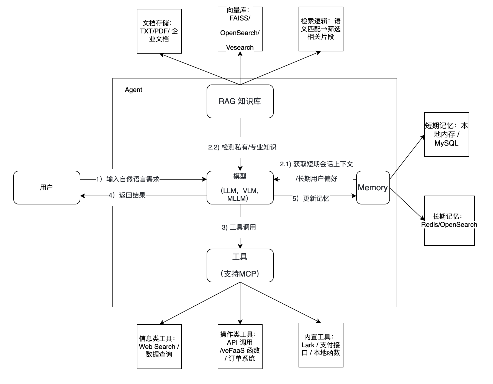

## 基本概念释义与设计原则

### 智能体（Agent）

**Agent 概述**： AI Agent（智能体）是依托智能模型作为核心决策与执行引擎的智能化实体，它以自然语言作为交互方式，接收外部指令，对输入进行感知，继而分析和决策，并采取相应行动。它并非孤立运作 —— 既能灵活调用搜索、计算、自动化操作等各类工具突破自身能力局限，又能通过记忆功能沉淀交互过程中的上下文、偏好及任务进度，还能对接行业数据、专业资料构建的知识库，快速调取精准信息支撑判断，最终实现从任务理解、规划到落地的全流程自主推进，成为具备自主学习和适应能力的智能协作伙伴。除此之外，Agent 可以通过 A2A协议和其他 Agent进行交互，组建更强大的能力。同时 Agent具有自我学习和演化能力，逐步提升自己。总的来说，Agent是未来人/机器与机器/服务交互的方式。

如上所说，智能体包含以下几个核心要素，包括智能模型，工具，记忆，知识库。如下图所示：

### 模型 （LLM，VLM，MLLM）
这是 Agent的大脑，包含大语言模型（LLM），视觉语言模型（VLM/MLLM）等。 它们理解用户自然语言输入或多模态输入，负责解析需求、规划步骤、判断工具调用逻辑，是 Agent的核心驱动。

### 工具（Tool）

工具是 Agent的手足，它们执行模型规划的具体任务，获取外部实时数据或操作结果（模型本身无法直接查天气、订机票、调用数据库等）。
常见工具类型如下：

| 类型 | 工具 | 描述 |
| :--- | :--- | :--- |
| **信息获取类** | `Web Search` | 搜索实时信息 |
| | `Vesearch` | 向量检索 |
| | `Web Scraper` | 爬取网页内容 |
| **系统操作类** | `API 调用` | 调用外部服务，如打车、支付、办公软件（Lark）等 |
| | `数据库查询` | 查询 LAS/Bytehouse 等数据库 |
| | `本地函数` | 执行 veFaaS/Lambda 等本地代码 |
| **标准化协议** | `MCP`, `Function Call` | 规范化模型与工具之间的交互 |

### 记忆（Memory）

Memory是 Agent的记忆，它们保存对话上下文和用户偏好，让 Agent 交互更连贯、个性化。

| 类型 | 描述 | 存储与实现 |
| :--- | :--- | :--- |
| **短期记忆** | 指单会话内的上下文。大语言模型基于上下文给出相关的回答，能记住你刚才说的内容，作为回答的输入，让对话更连贯和更有情感。 | 本地内存、MySQL（适合单会话临时存储） |
| **长期记忆** | 指多会话的历史偏好。通过对多轮会话为用户记录画像，识别用户兴趣，偏好，知识领域等，为后续会话提供个性化服务。 | OpenSearch、Redis（支持语义索引，快速检索历史偏好） |

### 知识库（Knowledge Base）  

知识库是 Agent的专业顾问，它们通过 RAG 技术补充模型的常识盲区，提供精准的专业/私有知识。

**核心作用**

| 作用 | 描述 |
| :--- | :--- |
| **补充私有知识** | 提供企业内部文档（如员工手册、产品说明）、行业资料（如医疗指南、法律条文）等模型训练数据中没有的内容。 |
| **减少幻觉** | 让 Agent 基于明确的知识库生成答案，避免“一本正经地胡说八道”。 |

**存储与实现**

| 要点 | 描述 |
| :--- | :--- |
| **文档支持** | TXT、PDF、Word 等，可自动分片处理。 |
| **存储工具** | OpenSearch、Viking DB等|
| **核心技术** | RAG（检索增强生成），先从知识库检索相关片段，再传给模型生成答案。 |

上述是Agent的基本概念和几个核心要素的简介，更多信息可以参阅下文中独立章节的详细介绍。