## 前置准备
在开始部署之前，请确保你已完成以下准备工作：

1.  **创建火山引擎账号**：你首先需要一个有效的火山引擎账号。
2.  **开通相关云服务**：为了成功部署和访问 Veadk 应用，你需要在火山引擎控制台中激活以下服务。这些通常是首次访问服务时根据引导完成的一次性操作。
    *   [**函数服务 (veFaaS)**](https://console.volcengine.com/vefaas)：用于托管和运行你的 Agent 应用代码。
    *   [**API 网关 (API Gateway)**](https://console.volcengine.com/veapig)：用于创建和管理 API，使你的 Agent 应用能够从外部访问。
在部署到火山引擎前，你需要提前在火山引擎控制台开通 [函数服务](https://console.volcengine.com/vefaas) 和  [API网关](https://console.volcengine.com/veapig) 服务。如果你事先已开通过服务，可以忽略该环节。

### 首次开通服务授权

如果你是首次使用上述服务，控制台会引导你完成必要的 IAM (Identity and Access Management) 角色授权。

1.  访问 [函数服务](https://console.volcengine.com/vefaas) 或 [API 网关](https://console.volcengine.com/veapig) 的控制台页面。
2.  在页面弹出的授权提示中，单击 **立即授权**。
3.  授权成功后，系统会自动跳转至对应服务的控制台主页，表明服务已成功开通。

> ⚠️ **注意**：此授权步骤是必需的，它授予函数服务和 API 网关访问其他云资源的权限，以确保应用能够正常部署和运行。


### 函数服务
1. 首次进入 [函数服务](https://console.volcengine.com/vefaas) 页面，控制台将会提醒你进行IAM角色的开通，请点击【立即授权】同意角色开通。
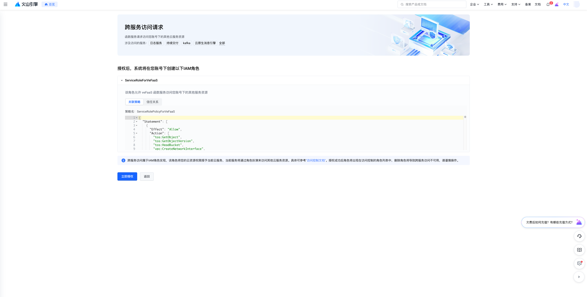
2. 点击后，控制台将会显示你已完成授权。几秒后将会自动跳转会 [函数服务](https://console.volcengine.com/vefaas) 控制台。当展示如下页面时，[函数服务](https://console.volcengine.com/vefaas) 服务即开通成功。
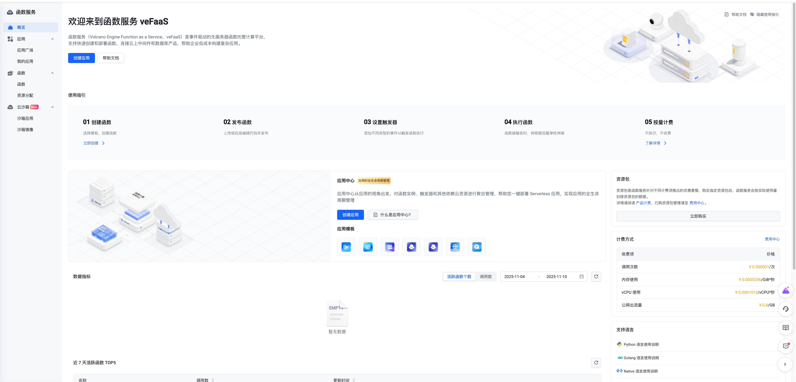
### API网关
1. 首次进入 [API网关](https://console.volcengine.com/veapig) 页面，控制台将会提醒你进行IAM角色的开通，请点击【立即授权】同意角色开通。
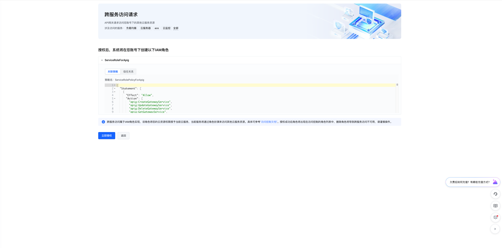
2. 点击后，控制台将会显示你已完成授权。几秒后将会自动跳转会 [API网关](https://console.volcengine.com/veapig) 控制台。当展示如下页面时，[API网关](https://console.volcengine.com/veapig) 服务即开通成功。
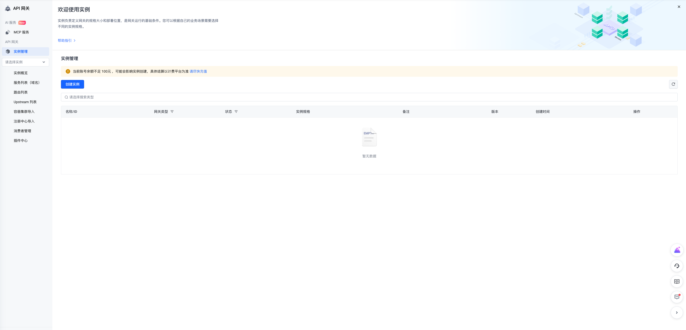

## 部署方式概览

Veadk 提供多种部署方式以适应不同的开发工作流：

*   **通过命令行工具 (CLI) 部署**：最快捷的方式，适合快速创建、部署和迭代 Agent 应用。
*   **通过 Python SDK 部署**：允许你通过编写代码以编程方式管理部署流程，适合集成到自动化脚本或现有项目中。
*   **设置持续交付 (CI/CD)**：与代码仓库（如 GitHub）集成，实现代码提交后自动构建和部署，是团队协作和生产环境的最佳实践。

接下来，我们将详细介绍每种部署方式的操作步骤。

## 通过命令行工具 (CLI) 部署

您可以从以下两个方式来部署使用 VeADK 建设的 Agent 项目。

### 方式一：从零开始创建并部署新项目

如果你想快速启动一个标准的企业级 Agent 项目，`veadk init` 命令是最佳选择。它会为你生成一个预设了完整结构和配置的模板项目。

#### 1. 初始化项目

在你的终端中运行以下命令：

```shell
veadk init
```

该命令会引导你完成项目的基本配置。你需要根据提示输入以下信息：

```shell
$ veadk init
Welcome use VeADK to create your project. We will generate a `weather-reporter` application for you.
Local directory name [veadk-cloud-proj]: 
Volcengine FaaS application name [veadk-cloud-agent]: 
Volcengine API Gateway instance name []: 
Volcengine API Gateway service name []: 
Volcengine API Gateway upstream name []: 
Choose a deploy mode:
  1. A2A/MCP Server
  2. VeADK Web / Google ADK Web
Enter your choice (1, 2): 1
Template project has been generated at .../veadk-cloud-proj
Edit .../veadk-cloud-proj/src to define your agents
Edit .../veadk-cloud-proj/deploy.py to define your deployment attributes
Run python `deploy.py` for deployment on Volcengine FaaS platform.
```

**参数说明**：

*   **Local directory name**：项目在本地创建的目录名称。
*   **Volcengine FaaS application name**：你的应用在火山引擎函数服务平台的名称。**注意**：名称中不能包含下划线 `_`。
*   **Volcengine API Gateway ...**：API 网关相关的实例、服务和上游名称。这些为**可选**参数。如果留空，Veadk 会在部署时自动创建和关联相应的网关资源。
*   **Choose a deploy mode**：选择部署模式。
    *   `A2A/MCP Server`：标准的后端 Agent 服务模式。
    *   `VeADK Web / Google ADK Web`：如果你需要一个 Web 交互界面，请选择此项。

项目初始化完成后，你可以在生成的 `deploy.py` 文件中随时修改这些配置。

生成后的项目结构如下：
```shell
veadk-cloud-proj
├── __init__.py
├── clean.py # 清除脚本
├── config.yaml.example # 定义环境变量
├── deploy.py # 部署脚本
└── src
    ├── __init__.py
    ├── agent.py # agent 运行时数据导出
    ├── app.py # Server 定义
    ├── requirements.txt 依赖
    ├── run.sh # 启动脚本
    └── weather_report # agent module
        ├── __init__.py # 必须包含`from . import agent`
        └── agent.py # agent 定义
```

#### 2. 配置环境变量与凭证

部署前，你需要配置必要的环境变量，特别是访问火山引擎所需的身份凭证。

1.  在项目根目录下，将 `config.yaml.example` 文件复制一份并重命名为 `config.yaml`。
2.  编辑 `config.yaml` 文件，填入你的火山引擎访问密钥 (Access Key 和 Secret Key)。
3.  如果是新建的火山账号，还需确认是否已经授权给`ServerlessApplicationRole`角色。进入[创建应用页面](https://console.volcengine.com/vefaas/region:vefaas+cn-beijing/application/create?templateId=67f7b4678af5a6000850556c)点击[一键授权]即可。
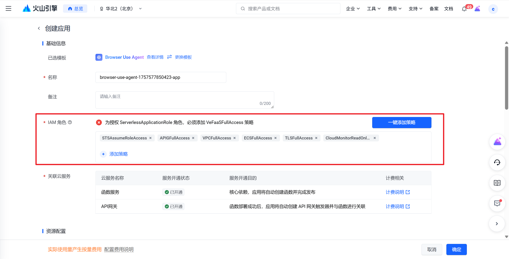

```yaml
volcengine:
  access_key: "YOUR_ACCESS_KEY"    # 替换为你的火山引擎 Access Key
  secret_key: "YOUR_SECRET_KEY"  # 替换为你的火山引擎 Secret Key
```

> ⚠️ **重要提示**：`config.yaml` 文件包含了敏感的凭证信息，它不会被上传到云端。文件中的配置项会作为环境变量注入到函数服务的运行环境中。请务必确保此文件的安全，不要将其提交到公共代码仓库。

#### 3. 执行部署

完成配置后，在项目根目录下运行部署脚本：

```shell
python deploy.py
```

脚本执行后，如果看到 `Start to release VeFaaS application` 的提示，说明部署流程已开始。当终端输出以下类似信息时，代表你的 Agent 应用已成功部署并发布。

```shell
VeFaaS application ID: 3b015fxxxxxx
Test message: How is the weather like in Beijing?
```

### 方式二：部署现有项目
如果你已经有一个本地开发的 Agent 项目，可以使用 `veadk deploy` 命令将其快速部署到火山引擎函数服务平台。

#### 1. 项目准备
在执行部署前，请确保你的项目满足以下结构要求：

*   项目根目录下必须包含一个 `agent.py` 文件，且该文件中定义了一个全局变量 `root_agent`。
*   项目根目录下必须包含一个 `__init__.py` 文件，且该文件中包含了 `from . import agent` 语句。

#### 2. 执行部署

在你的项目根目录下运行以下命令：

```shell
veadk deploy --vefaas-app-name 「YourAgentAppName}
```

请将 `{YourAgentAppName}` 替换为你的应用名称。执行后，如果看到 `Start to release VeFaaS application` 的提示，说明部署已开始。

`veadk deploy`命令支持丰富的参数以进行详细配置，你可以通过命令行标志传入，或通过环境变量设置。

| 名称 | 类型 | 释义                              | 
|------|-------|---------------------------------|
| --access-key | 字符串 | 火山引擎AK                          |
| --secret-key | 字符串 | 火山引擎SK                          |
| --vefaas-app-name | 字符串 | 火山引擎 VeFaaS 平台应用名称              |
| --veapig-instance-name | 字符串 | 火山引擎网关实例名称                      |
| --veapig-service-name | 字符串 | 火山引擎网关服务名称                      |
| --veapig-upstream-name | 字符串 | 火山引擎网关Upstream名称                |
| --short-term-memory-backend | 字符串 | `local`或者 `mysql`， 短期记忆后端       |
| --use-adk-web | FLAG | 设置后将会在云端启动 web，否则为 A2A / MCP 模式 |
| ---path | 字符串 | 本地项目路径，默认为当前目录                  |


## 通过 Python SDK 部署
对于希望将部署流程集成到自动化脚本或现有代码库中的开发者，Veadk 提供了强大的 Python SDK。你可以通过 `CloudAgentEngine` 类以编程方式完成应用的部署、更新和删除。

### 1. 部署 Agent 应用

`CloudAgentEngine` 是部署操作的核心。实例化该类后，调用其 `deploy` 方法即可部署你的 Agent 项目。

**凭证配置**：

在实例化 `CloudAgentEngine` 时，你可以直接传入火山引擎的 AK/SK。如果未提供，SDK 会自动从环境变量 `VOLCENGINE_ACCESS_KEY` 和 `VOLCENGINE_SECRET_KEY` 中读取。

**代码示例**：

```python
from veadk.cloud.cloud_agent_engine import CloudAgentEngine

# 1. 初始化云引擎，凭证将从环境变量自动获取
engine = CloudAgentEngine()

# 2. 调用 deploy 方法部署应用
cloud_app = engine.deploy(
    application_name="my-python-agent",
    path="./path/to/your/agent/project",
    gateway_name="my-agent-gateway",
    use_adk_web=False
)

# 部署成功后，可以获取应用的访问端点
print(f"Application endpoint: {cloud_app.vefaas_endpoint}")
```

`deploy` 方法的关键参数如下：

| 名称 | 类型   | 释义                           | 
|------|------|------------------------------|
| path | 字符串  | 本地Agent项目路径                    |
| application_name | 字符串  | 火山引擎 VeFaaS 平台应用名称                      |
| gateway_name | 字符串  | 火山引擎网关实例名称            |
| gateway_service_name | 字符串  | 火山引擎网关服务名称               |
| gateway_upstream_name | 字符串  | 火山引擎网关Upstream名称               |
| use_adk_web | 布尔值  | 是否在云端使用VeADK Web / Google Web     |

### 2. 管理已部署的应用

`deploy` 方法成功执行后，会返回一个 `CloudApp` 实例。这个实例代表了你在云端部署的应用，你可以使用它来进行后续的管理操作，如发起调用、更新代码或删除应用。

#### 发起远程调用

你可以通过 `CloudApp` 实例与云端的 Agent 进行交互。主要方法包括创建会话 (`create_session`) 和发送消息 (`invoke`)。

**代码示例**：

```python
from veadk.cloud.cloud_app import CloudApp

# 假设 cloud_app 是通过 engine.deploy() 返回的实例
cloud_app: CloudApp = CloudApp()

# 定义会话和用户信息
USER_ID = "test_user_001"
SESSION_ID = "test_session_123"

# 1. 发起调用（发送消息）
response = cloud_app.message_send(
    user_id=USER_ID,
    session_id=SESSION_ID,
    message="请问北京今天天气怎么样？"
)

print(f"Agent response: {response}")
```

如果你需要与一个已经部署好的应用进行交互（而非在部署后立即交互），你也可以通过提供应用的访问端点 (Endpoint) 来创建一个 `CloudApp` 实例。

```python
from veadk.cloud.cloud_app import CloudApp

# 应用的访问端点 URL，可以在函数服务控制台找到
APP_ENDPOINT = "<YOUR_APPLICATION_ENDPOINT>"
SESSION_ID = "<test_session>"
USER_ID = "<test_user>"

# 通过端点创建 CloudApp 实例
app = CloudApp(vefaas_endpoint=APP_ENDPOINT)

# 后续调用方式相同
response = app.message_send(user_id=USER_ID, session_id=SESSION_ID, message="深圳呢？")
print(f"Agent response: {response}")
```

#### 更新应用代码
当你本地的 Agent 代码有更新时，可以使用 `update_function_code` 方法来更新已部署的应用，而无需重新创建一个新应用。
> ⚠️ **注意**：此操作只会更新函数的代码和配置，应用原有的访问端点 (Endpoint) 会保持不变。
```python
from veadk.cloud.cloud_agent_engine import CloudAgentEngine

engine = CloudAgentEngine()

# 更新现有应用的代码，保持相同的访问端点
updated_cloud_app = engine.update_function_code(
    application_name="my-agent-app",  # 现有应用名称
    path="/my-agent-project"        # 本地项目路径，确保项目路径包含agent.py文件
)

# 可以使用updated_cloud_app.vefaas_endpoint访问您的项目

```
#### 删除应用

如果你需要下线并删除一个已部署的应用，可以使用 `remove` 方法。

> ⚠️ **警告**：删除操作是不可逆的，它将彻底移除函数服务应用及其相关配置。请谨慎操作。

**代码示例**：

```python
from veadk.cloud.cloud_agent_engine import CloudAgentEngine

engine = CloudAgentEngine()

# 调用 remove 方法删除指定应用
engine.remove(app_name="my-python-agent")
```

为了防止误操作，执行此命令时，终端会要求你进行确认。你需要输入 `y` 并按回车键才能完成删除。

```shell
Confirm delete cloud app my-python-agent? (y/N): y
```


## 验证与调用应用
应用部署成功后，你可以通过火山引擎控制台验证部署状态，并使用不同协议与你的 Agent 服务进行交互。

### 在控制台验证部署
1. 登录 [火山引擎函数服务 (veFaaS) 控制台](https://console.volcengine.com/vefaas)。
2. 在左侧导航栏中，选择 **我的应用**。
1. 在应用列表中，你应该能看到你刚刚部署的应用。你可以单击应用名称进入详情页，查看其配置、日志、监控和访问端点等信息。
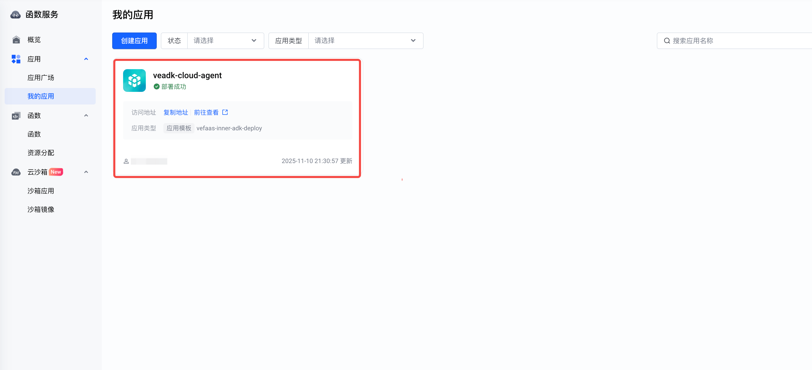

### 调用方法
部署完成后，Veadk Agent 服务支持通过两种标准协议进行调用：A2A (Agent-to-Agent) 和 MCP (Meta-protocol for Calling Plugins)。

> **关于 API 网关认证**：
> 默认情况下，Veadk 通过 API 网关创建的服务会启用密钥认证 (Key Authentication) 插件，以确保接口的安全性。这意味着所有发向该接口的请求都需要在请求中包含正确的认证凭证 (Token)。
> *   **对于生产环境**：强烈建议保留此安全设置，并在你的客户端代码中正确传递认证凭证。
> *   **对于快速测试**：如果你在内部测试环境中需要临时绕过认证，可以手动在 [API 网关控制台](https://console.volcengine.com/veapig) 的 **插件中心** 找到对应的插件并将其**禁用**。但请注意，这会使你的 API 端点暴露于公网，带来安全风险。

#### 1. 获取认证凭证 (Key Auth Token)

1.  登录 [API 网关控制台](https://console.volcengine.com/veapig)。
2.  在左侧导航栏中，选择 **消费者管理**。
3.  找到与你的应用关联的消费者，并复制其 **Key Auth Token**。

#### 2. 通过 A2A 协议调用

A2A 协议用于 Agent 之间的直接通信。你可以使用 `CloudApp` 或 `RemoteVeAgent` 类来发起调用。

**方式一：直接调用 (使用 `CloudApp`)**

```python
import asyncio
from veadk.cloud.cloud_app import CloudApp

# -- 配置 --
ENDPOINT = "<YOUR_APPLICATION_ENDPOINT>"  # 替换为你的应用访问端点
SESSION_ID = "test_session"
USER_ID = "test_user"
TEST_MESSAGE = "北京今天的天气怎么样？"

async def main():
    # 使用端点初始化 CloudApp 实例
    app = CloudApp(vefaas_endpoint=ENDPOINT)
    
    # 发送消息
    response = await app.message_send(TEST_MESSAGE, SESSION_ID, USER_ID)
    print(f"A2A Response: {response}")

if __name__ == "__main__":
    asyncio.run(main())
```

> ⚠️ **注意**：上述 `CloudApp` 的直接调用方式默认不会携带认证信息。如果你的 API 网关开启了密钥认证，此调用会失败。你需要使用下一种方式，或临时关闭认证插件。
> 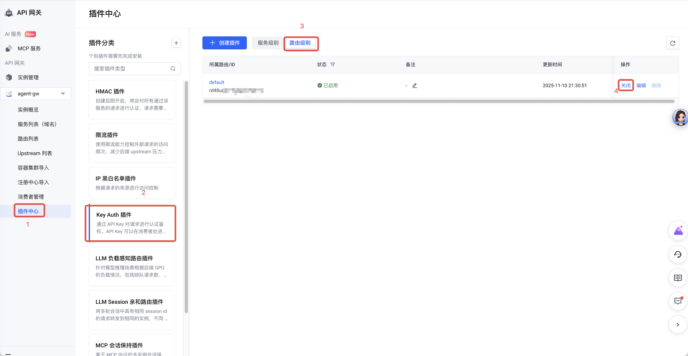

**方式二：作为子 Agent 远程调用 (使用 `RemoteVeAgent`)**

它将云端的 Agent 封装为一个 `RemoteVeAgent` 对象，并在本地作为另一个 Agent 的子 Agent 来调用，同时可以方便地处理认证。

```python
import asyncio
from veadk import Agent, Runner
from veadk.a2a.remote_ve_agent import RemoteVeAgent

# -- 配置 --
ENDPOINT = "<YOUR_APPLICATION_ENDPOINT>"      # 替换为你的应用访问端点
KEY_AUTH_TOKEN = "<YOUR_KEY_AUTH_TOKEN>"  # 替换为你的 Key Auth Token
SESSION_ID = "test_session"
USER_ID = "test_user"
TEST_MESSAGE = "上海呢？"

async def main():
    # 1. 将云端 Agent 封装为 RemoteVeAgent
    remote_agent = RemoteVeAgent(
        name="cloud_weather_agent",
        url=ENDPOINT,
        auth_token=KEY_AUTH_TOKEN,
        auth_method="querystring"  # 指定 token 通过查询字符串传递
    )

    # 2. 创建一个本地 Agent，并将远程 Agent 作为其子 Agent
    local_agent = Agent(
        name="local_query_agent",
        instruction="将用户问题转发给云端 Agent 并返回结果。",
        sub_agents=[remote_agent],
    )

    # 3. 使用 Runner 执行任务
    runner = Runner(agent=local_agent, user_id=USER_ID)
    response = await runner.run(TEST_MESSAGE, session_id=SESSION_ID)
    print(f"A2A Remote Response: {response}")

if __name__ == "__main__":
    asyncio.run(main())
```

#### 3. 通过 MCP 协议调用

MCP 协议提供了一种标准化的方式来发现和调用插件（即你的 Agent）。你可以使用 `fastmcp` 库来构造客户端。

```python
import asyncio
from fastmcp import Client

# -- 配置 --
ENDPOINT = "<YOUR_APPLICATION_ENDPOINT>"      # 替换为你的应用访问端点
KEY_AUTH_TOKEN = "<YOUR_KEY_AUTH_TOKEN>"  # 替换为你的 Key Auth Token
SESSION_ID = "my_test_session_03"
USER_ID = "my_test_user_03"
TEST_MESSAGE = "广州今天天气如何？"

async def main():
    # 构造带有认证 token 的 MCP 端点 URL
    mcp_endpoint = f"{ENDPOINT}/mcp?token={KEY_AUTH_TOKEN}"
    
    # 如果关闭了网关的密钥认证，则无需 token 参数
    # mcp_endpoint = f"{ENDPOINT}/mcp"

    client = Client(mcp_endpoint)
    async with client:
        # 发现可用的工具 (Agent)
        tools = await client.list_tools()
        print(f"MCP Available Tools: {tools}")

        # 调用 run_agent 工具
        response = await client.call_tool(
            "run_agent",
            {
                "user_input": TEST_MESSAGE,
                "session_id": SESSION_ID,
                "user_id": USER_ID,
            },
        )
        print(f"MCP Response: {response}")

if __name__ == "__main__":
    asyncio.run(main())
```


## 持续交付
为了实现更高效、自动化的开发工作流，Veadk 支持与火山引擎的[持续交付](https://console.volcengine.com/cp) (Continuous Delivery, CP) 和[镜像仓库](https://console.volcengine.com/cr) (Container Registry, CR) 服务集成。通过设置 CI/CD 流水线，你可以将代码提交、构建、测试和部署等环节自动化，实现代码变更后自动发布新版本。
> **最佳实践**：通过容器镜像进行部署是生产环境中的最佳实践，它能确保开发、测试和生产环境的一致性，并简化部署流程。

### 1. 前提条件：开通相关服务

在使用持续交付功能前，请确保你已在火山引擎控制台开通以下服务：

*   [**持续交付 (CP)**](https://console.volcengine.com/cp)
*   [**镜像仓库 (CR)**](https://console.volcengine.com/cr)

与函数服务和 API 网关类似，首次访问这些服务时，你需要根据页面提示完成 **IAM 角色授权**。
#### 持续交付
1. 首次进入 [持续交付](https://console.volcengine.com/cp) 页面，控制台将会提醒你进行IAM角色的开通，请点击【立即授权】同意角色开通。
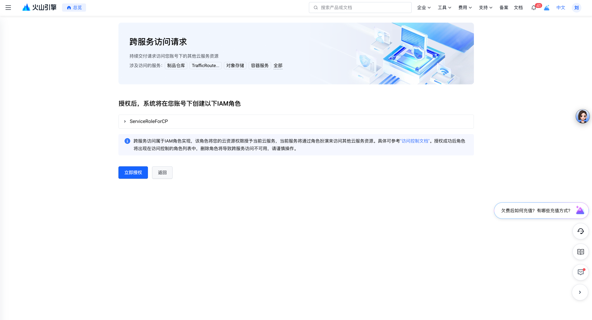
2. 点击授权后，控制台将会继续为你开通服务，界面如下。
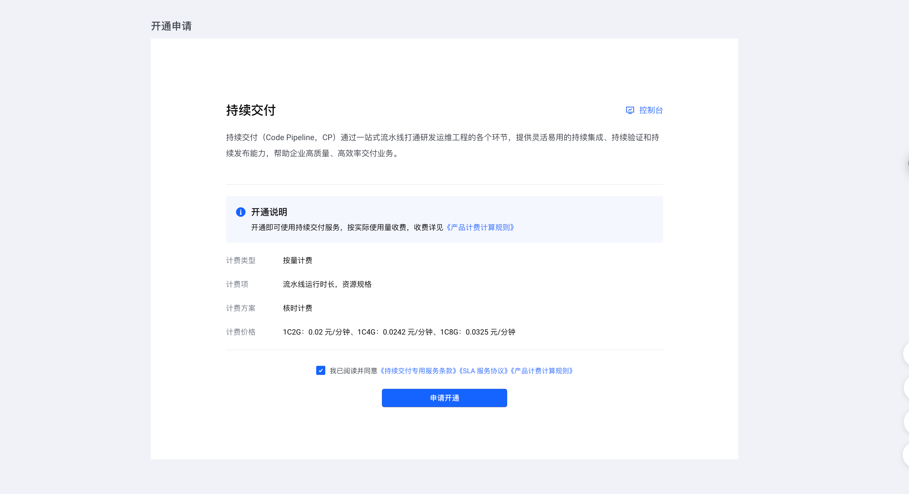
3. 当点击【申请开通】后，控制台将会自动跳转。当展示如下页面时，[持续交付](https://console.volcengine.com/cp)` 服务即开通成功。
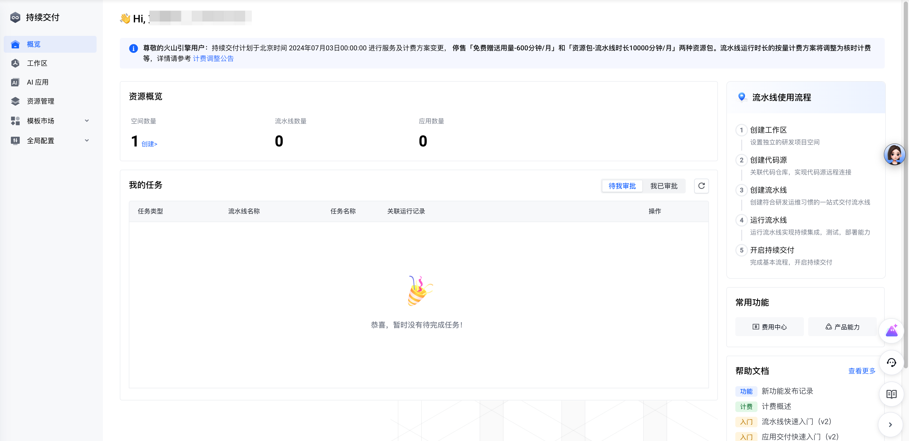
#### 镜像仓库
1. 首次进入 [镜像仓库](https://console.volcengine.com/cr) 页面，控制台将会提醒你进行IAM角色的开通，请点击【立即授权】同意角色开通。
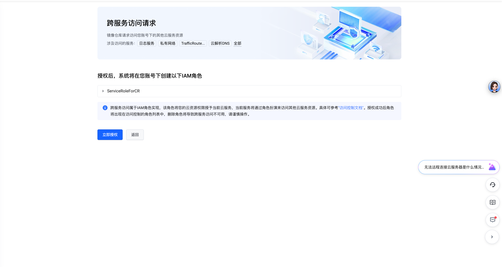
3. 点击授权后，控制台将会自动跳转。当展示如下页面时，[持续交付](https://console.volcengine.com/cp) 服务即开通成功。
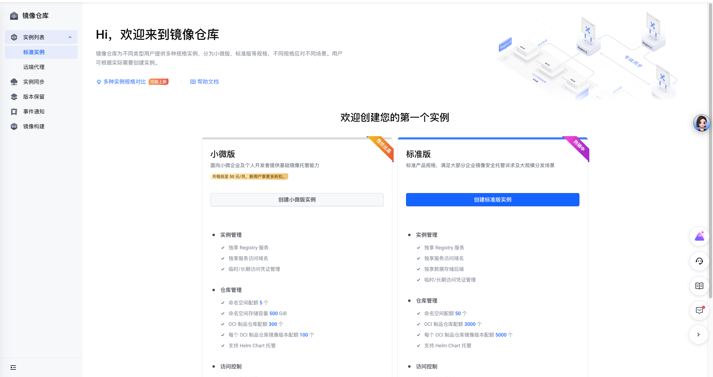


### 2. 挂载持续交付流水线
VeADK 内置了火山引擎[持续交付](https://console.volcengine.com/cp)产品来便捷您的部署与持续交付。结合火山引擎[镜像仓库](https://console.volcengine.com/cr)产品，能够通过镜像将您的项目持续交付到火山引擎 FaaS 服务。

使用命令 `veadk pipeline` 来连结您的代码仓库与火山引擎[镜像仓库](https://console.volcengine.com/cr)、[持续交付](https://console.volcengine.com/cp)服务。命令的主要工作流程：
1. 帮助您在 VeFaaS 上创建一个含有模板镜像（Simple FastAPI）的镜像函数
2. 将[持续交付](https://console.volcengine.com/cp)服务绑定至您的 Github 仓库与创建好的 VeFaaS 函数

配置完成后，每当你向指定的 GitHub 仓库分支提交代码时，流水线将被自动触发，并执行以下操作：

1.  **构建镜像**：基于你的项目代码构建一个容器镜像。
2.  **推送镜像**：将构建好的镜像推送到你的私有[镜像仓库](https://console.volcengine.com/cr) (CR) 中。
3.  **部署更新**：使用新镜像更新函数服务 (veFaaS) 中的应用，完成新版本的发布。

#### 使用方法

在你的项目目录下，运行 `veadk pipeline` 命令并提供必要的参数。一个典型的调用如下：

```shell
veadk pipeline --github-url <YOUR_GITHUB_REPO_URL> --github-branch main --github-token <YOUR_GITHUB_TOKEN>
```
> ⚠️ **注意**：在运行此命令的目录中，请确保已准备好 `config.yaml` 文件。文件中的配置项（如 API Keys 或其他环境变量）将在构建镜像时被打包到应用中。
命令 veadk pipeline 参数：

#### 参数详解
| 参数 | 说明 | 默认值 / 必填                     | 
|------|----|------------------------------|
| `--github-url`| Github 仓库 URL  | 必填                           |
|`--github-branch`		|Github 项目的分支	| 必填                           |
|`--veadk-version`	|VeADK 版本，可选值：`preview`（主分支）、`latest`（最新稳定版）、`x.x.x`（具体版本号）| 当前版本号                        |
|`--github-token`	|Github Token，用于管理项目| 	必填                          |
|`--volcengine-access-key`|	火山引擎 Access Key	| 使用环境变量 `VOLCENGINE_ACCESS_KEY` |
|`--volcengine-secret-key`	|火山引擎 Secret Key	| 使用环境变量 `VOLCENGINE_SECRET_KEY` |
|`--region`|	火山引擎产品区域	cn-beijing
|`--cr-instance-name`|	火山引擎容器镜像仓库实例名| 	`veadk-user-instance`         |
|`--cr-namespace-name`|	火山引擎容器镜像仓库命名空间	| `veadk-user-namespace`         |
|`--cr-repo-name`	|火山引擎容器镜像仓库 Repo 名称	|veadk-user-repo|
|`--vefaas-function-id`	|火山引擎 FaaS 函数 ID（要求为镜像函数），如未设置，将自动创建新函数|	-|
