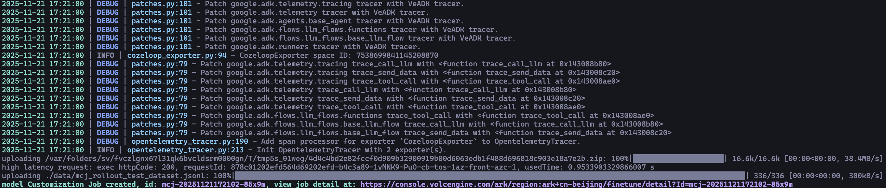
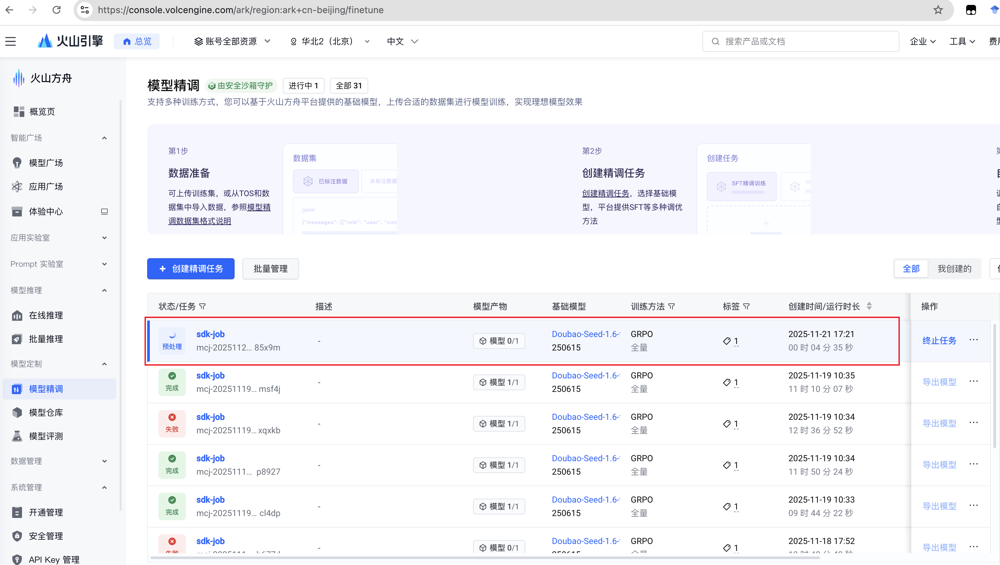
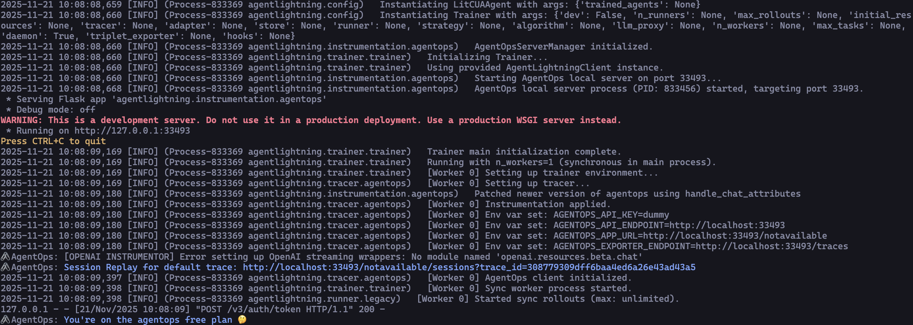
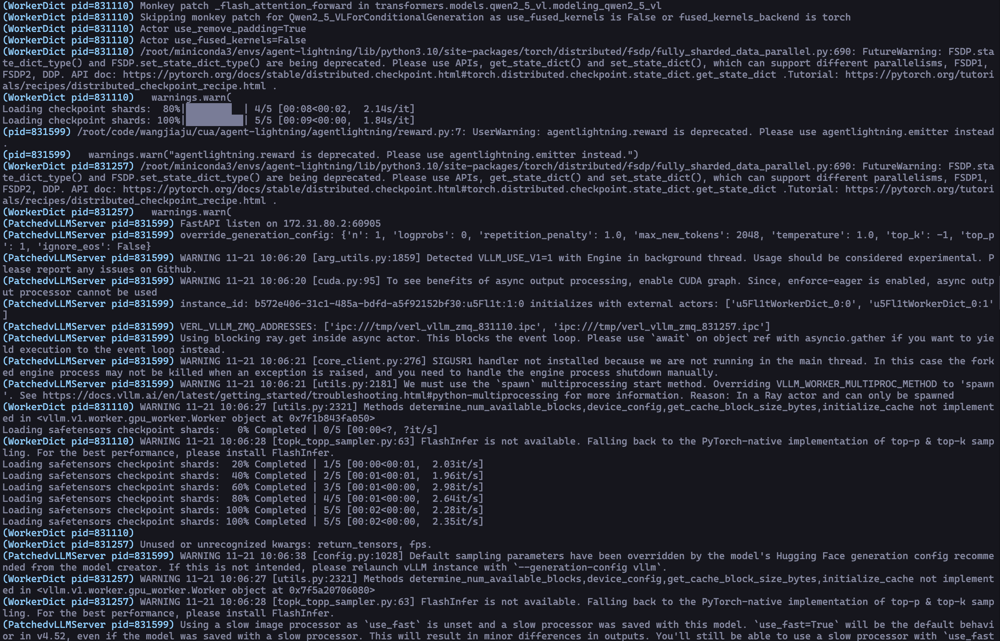

## Prompt 优解

Prompt（提示词）作为大模型的核心输入指令，直接影响模型的理解准确性和输出质量。优质的 Prompt 能显著提升大语言模型处理复杂任务的能力。

[PromptPilot](https://www.volcengine.com/docs/82379/1399495?lang=zh) 提供全流程智能优化，涵盖生成、调优、评估和管理全阶段。

### 调用方法

```shell
veadk prompt
```

选项包括：
```shell
--path：指定要优化的 Agent 文件路径，默认值为当前目录下 agent.py。注意，必须将定义的智能体作为全局变量导出
--feedback：指定优化后的提示词反馈，用于优化模型
--api-key：指定 AgentPilot 平台的 API Key，用于调用优化模型
--model-name：指定优化模型的名称
```

## 强化学习

在对效果与泛化能力要求高的复杂业务场景中，强化学习（RL）相比 PE、SFT、DPO 等方式上限更高，更贴合业务核心诉求：

- 基于反馈迭代的训练模式，更好激发模型推理与泛化能力；
- 无需大量标注数据，成本更低、实现更简单；
- 支持按业务指标反馈打分优化，可直接驱动指标提升。

针对上述问题与需求，VeADK 提供了内置的强化学习解决方案，包括：

- 基于 [方舟平台强化学习](https://www.volcengine.com/docs/82379/1099460) 的解决方案
- 基于 [Agent Lightning](https://github.com/microsoft/agent-lightning) 的解决方案

### 基于方舟平台强化学习

方舟 RL 将强化学习过程进行了一定程度的封装，降低了复杂度。用户主要关注 rollout 中的 agent 逻辑、奖励函数的构建、训练样本的选择即可。

VeADK 与方舟平台 Agent RL 集成，用户使用 VeADK 提供的脚手架，可以开发 VeADK Agent，然后提交任务到方舟平台进行强化学习优化。

#### 准备工作

在你的终端中运行以下命令，初始化一个强化学习项目：

```shell
veadk rl init --platform ark --workspace veadk_rl_ark_project
```
该命令会在当前目录下创建一个名为 `veadk_rl_ark_project` 的文件夹，其中包含了一个基本的强化学习项目结构。
然后在终端中运行以下命令，提交任务到方舟平台：

```shell
cd veadk_rl_ark_project
veadk rl submit --platform ark
```

#### 原理说明

生成后的项目结构如下，其中核心文件包括：
- 数据集: `data/*.jsonl`
- `/plugins`文件夹下的rollout和reward:
  - rollout ：用以规定agent的工作流，`raw_async_veadk_rollout.py`提供了使用在方舟rl中使用veadk agent的示例，
  - reward：给出强化学习所需的奖励值，在`random_reward.py`给出了示例
- `job.py`或`job.yaml`：用以配置训练参数，并指定需要使用的rollout和reward

```shell
veadk_rl_ark_project
├── data
    ├── *.jsonl # 训练数据
└── plugins
    ├── async_weather_rollout.py # 
    ├── config.yaml.example # VeADK agent 配置信息示例
    ├── random_reward.py # reward规则设定
    ├── raw_async_veadk_rollout.py # rollout工作流设定
    ├── raw_rollout.py # 
    └── test_utils.py #
    └── weather_rollout.py # 
├── job.py # 任务提交代码
├── job.yaml # 任务配置
├── test_agent.py # VeFaaS 测试脚本
```

#### 最佳实践案例
1. 脚手架中，基于 VeADK 的天气查询 Agent 进行强化学习优化
2. 提交任务 (veadk rl submit --platform ark)




3. 查看训练日志和时间线


### Agent Lightning

Agent Lightning 提供了灵活且可扩展的框架，实现了智能体（client）和训练（server）的完全解耦。
VeADK 与 Agent Lightning 集成，用户使用 VeADK 提供的脚手架，可以开发 VeADK Agent，然后运行 client 与 server 进行强化学习优化。

#### 准备工作

在你的终端中运行以下命令，初始化一个 Agent Lightning 项目：

```shell
veadk rl init --platform lightning --workspace veadk_rl_lightning_project
```
该命令会在当前目录下创建一个名为 `veadk_rl_lightning_project` 的文件夹，其中包含了一个基本的基于 VeADK 和 Agent Lightning 的强化学习项目结构。
然后在终端1中运行以下命令，启动 client：

```shell
cd veadk_rl_lightning_project
veadk rl run --platform lightning --client
```

然后在终端2中运行以下命令，启动 server：

```shell
cd veadk_rl_lightning_project
veadk rl run --platform lightning --server
```

#### 原理说明

生成后的项目结构如下，其中核心文件包括：
- agent_client: `examples/*/*_agent.py` 中定义了agent的rollout逻辑和reward规则
- training_server: `examples/*/train.py` 定义了训练相关参数,用于启动训练服务器

```shell
veadk_rl_lightning_project
├── agentligtning 
    ├── runner # 运行器：负责任务执行、调度、主流程管理
    ├── tracer # 追踪模块：记录日志、链路追踪、调试信息
    ├── trainer  # 训练模块：支持模型训练、微调与评估逻辑
    ├── verl # VERL强化学习组件
    └── server.py # 训练服务器
└── examples # 示例项目,包含若干示例
    ├── spider # 示例一：Spider 数据库问答任务
        ├── sql_agent.py # sql agent的rollout逻辑和reward设定
        ├── train.sh #训练服务器启动脚本,设定训练相关参数
        └── data # 数据集
            ├── train.parquet # 训练数据集,需要为parquet格式
            └── eval.parquet # 评测数据集,需要为parquet格式
    ├── rag # 示例二：RAG 应用示例
        ├── rag_agent.py # rag agent的rollout逻辑和reward设定
        └── train.sh #训练服务器启动脚本,设定训练相关参数
    └── calc_x # 示例三：计算 agent 应用示例
        ├── calc_agent.py # calculate agent的rollout逻辑和reward设定
        └── train.sh #训练服务器启动脚本,设定训练相关参数
    
```

#### 最佳实践案例

1. 脚手架中，基于 VeADK 的天气查询 Agent 进行强化学习优化
2. 启动 client (veadk rl run --platform lightning --client) 与 server (veadk rl run --platform lightning --server)，分别在终端1与终端2中运行以上命令






