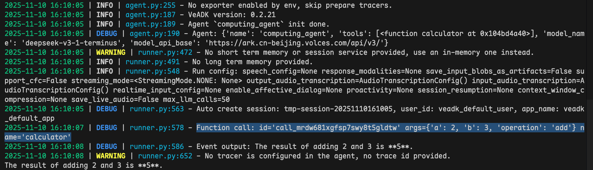
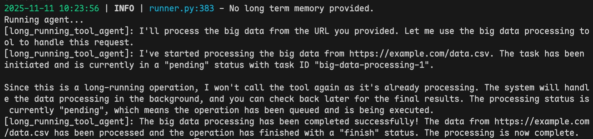

本文档介绍如何在智能体系统中创建与使用**自定义工具（Custom Tools）**，以扩展内置能力。  
自定义工具可以满足特定业务逻辑需求，包括普通函数调用、带上下文的函数、以及长时间运行的任务等。  
通过组合自定义工具，VeADK 能够支持开发者构建更复杂、更贴合业务场景的智能体应用。

---

## 普通入参函数

普通入参函数是最基础的自定义工具形式，通过传入参数完成特定计算或逻辑处理。为实现一个普通入参函数，需要完成以下步骤：

1. 定义工具函数，使用简单、易懂的扁平化设计，来规范输入参数及返回类型；
2. 实现函数中的 Docstring，描述函数功能、参数及返回值；
3. 将工具注册到 Agent 的工具列表中。

下面我们将实现一个计算器来说明如何自定义一个普通入参函数，并将这个函数注册到 Agent 中。

```python title="agent.py" linenums="1" hl_lines="8-22 40"
--8<-- "examples/tools/function_tools/simple_function_tool.py"
```

运行后，可以看到如下结果：



Agent 会根据用户输入调用注册的工具函数，执行相应的计算或逻辑处理。

## 携带运行时上下文信息的函数

在您的工具定义函数中，通过携带有 `ToolContext` 类型的入参，能够访问智能体运行时上下文信息（如会话 ID、用户身份、环境变量等），从而实现更智能的决策。相比于定义普通入参函数，您需要额外传入 `ToolContext` 类型的入参，来获取智能体运行时上下文信息：

1. 定义函数时接受 `tool_context: ToolContext` 作为参数；
2. 在函数逻辑中处理传入的 `tool_context`。

下面通过一个简单的消息验证工具应用来演示如何使用携带有上下文信息 `ToolContext` 的函数。

```python title="agent.py" linenums="1" hl_lines="22-24 31"
--8<-- "examples/tools/function_tools/tool_context_usage.py"
```

运行结果如下图所示：


图中可以看到，工具函数中可以访问到智能体运行时上下文信息，例如会话 ID、用户身份、当前所执行的 Agent 信息等。

## 长时运行任务（Long-running Task）

长时运行任务工具适用于需要耗时处理或异步执行的操作，例如大规模计算、数据分析或批量处理任务。下面，我们将通过构建一个简单的数据处理工具来演示长时运行任务的实现。

**引入必要依赖**

```python linenums="1" hl_lines="5"
import asyncio
from typing import Any

from google.adk.events import Event
from google.adk.tools.long_running_tool import LongRunningFunctionTool
from google.genai.types import Content, FunctionCall, FunctionResponse, Part
from veadk import Agent, Runner
```

**定义长时任务工具**

```python linenums="1" hl_lines="19"
def big_data_processing(data_url: str) -> dict[str, Any]:
    """Process the big data from a specific data url.

    Args:
        data_url (str): The url of the big data to process.

    Returns:
        dict[str, Any]: A dictionary containing the result of the big data processing, the data url processed,
        and the status of the processing ("pending" or "finish").
    """
    # create a new task for processing big data.
    return {
        "status": "pending",
        "data-url": data_url,
        "task-id": "big-data-processing-1",
    }


long_running_tool = LongRunningFunctionTool(func=big_data_processing)
```

**初始化 Agent 及运行时元数据**

```python linenums="1"
APP_NAME = "long_running_tool_app"
USER_ID = "long_running_tool_user"
SESSION_ID = "long_running_tool_session"

agent = Agent(
    name="long_running_tool_agent",
    tools=[long_running_tool],
    instruction="Use long_running_tool to process big data",
)
runner = Runner(agent=agent, app_name=APP_NAME)

# 初始化 Session
session = asyncio.run(
    runner.short_term_memory.create_session(
        app_name=APP_NAME, user_id=USER_ID, session_id=SESSION_ID
    )
)
```

**定义运行函数并执行**

```python linenums="1"

async def call_agent_async(query):
    def get_long_running_function_call(event: Event) -> FunctionCall | None:
        # Get the long running function call from the event
        if (
            not event.long_running_tool_ids
            or not event.content
            or not event.content.parts
        ):
            return
        for part in event.content.parts:
            if (
                part
                and part.function_call
                and event.long_running_tool_ids
                and part.function_call.id in event.long_running_tool_ids
            ):
                return part.function_call

    def get_function_response(
        event: Event, function_call_id: str
    ) -> FunctionResponse | None:
        # Get the function response for the fuction call with specified id.
        if not event.content or not event.content.parts:
            return
        for part in event.content.parts:
            if (
                part
                and part.function_response
                and part.function_response.id == function_call_id
            ):
                return part.function_response

    content = Content(role="user", parts=[Part(text=query)])

    print("Running agent...")
    events_async = runner.run_async(
        session_id=session.id, user_id=USER_ID, new_message=content
    )

    long_running_function_call, long_running_function_response, task_id = (
        None,
        None,
        None,
    )
    async for event in events_async:
        # Use helper to check for the specific auth request event
        if not long_running_function_call:
            long_running_function_call = get_long_running_function_call(event)
        else:
            _potential_response = get_function_response(
                event, long_running_function_call.id
            )
            if _potential_response:  # Only update if we get a non-None response
                long_running_function_response = _potential_response
                task_id = long_running_function_response.response["task-id"]
        if event.content and event.content.parts:
            if text := "".join(part.text or "" for part in event.content.parts):
                print(f"[{event.author}]: {text}")

    if long_running_function_response:
        # query the status of the correpsonding ticket via tciket_id
        # send back an intermediate / final response
        updated_response = long_running_function_response.model_copy(deep=True)
        updated_response.response = {"status": "finish"}
        async for event in runner.run_async(
            session_id=session.id,
            user_id=USER_ID,
            new_message=Content(
                parts=[Part(function_response=updated_response)], role="user"
            ),
        ):
            if event.content and event.content.parts:
                if text := "".join(part.text or "" for part in event.content.parts):
                    print(f"[{event.author}]: {text}")


asyncio.run(call_agent_async("Process the big data from https://example.com/data.csv"))
```

执行结果如下图所示：


