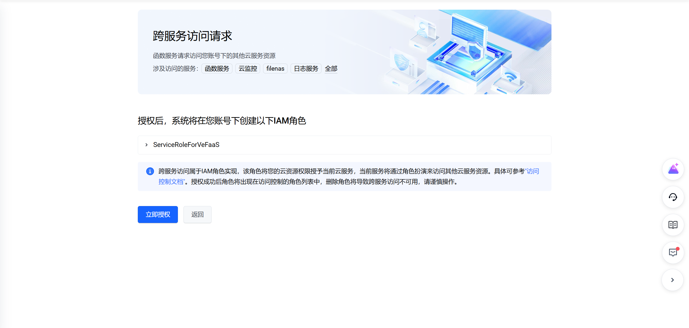
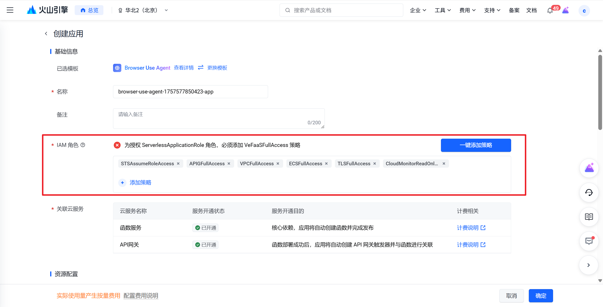
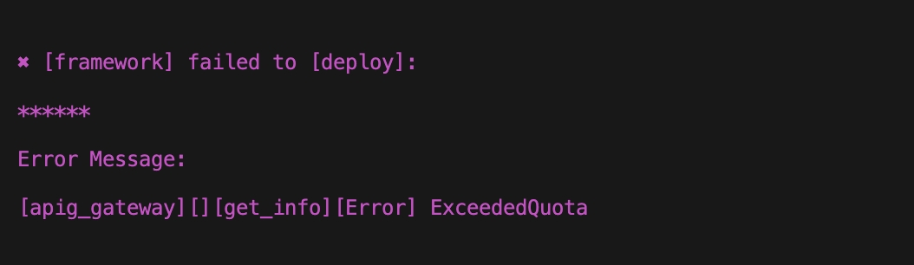

??? question "VeADK 与 Google ADK 的关系是什么，是否兼容？"

    VeADK 的 Agent 相关能力继承自 Google ADK，完全兼容 Google ADK 能力。Agent 相关能力也可参考 Google ADK 官方[文档](https://google.github.io/adk-docs/)，或参考[中文版](https://adk.wiki/)。

## 环境准备

??? question "使用知识库时，提示未找到 `llama-index` 等包"

    请安装 VeADK 扩展包：

    ```bash
    pip install veadk-python[extensions]
    ```

    在某些 Bash 中，您可能需要添加引号：

    ```bash
    pip install "veadk-python[extensions]"
    ```

## 开发环节

??? question "设置火山引擎 AK/SK 后，提示获取模型 API Key 失败"

    VeADK 不会帮助您自动创建火山引擎方舟平台 API Key，请您在火山方舟平台创建您的 API Key。具体步骤可见[文档](https://www.volcengine.com/docs/82379/1361424)，或直接进入[控制台入口](https://console.volcengine.com/ark/region:ark+cn-beijing/apiKey?apikey=%7B%7D)。

## 部署环节

??? question "在 Release 阶段卡住，云上没有报错"

    请先在 VeFaaS 平台开通权限

    

??? question "新账号开通后，缺少 ServerlessApplicationRole 授权"

    前往火山引擎函数服务官网，进入创建应用页面（例如[这里](https://console.volcengine.com/vefaas/region:vefaas+cn-beijing/application/create?templateId=67f7b4678af5a6000850556c)）点击「一键授权」即可

    

??? question "安装依赖失败，显示依赖安装空间不足"

    VeFaaS 最大依赖安装大小默认为 1024 MB，若需更大空间，请联系火山引擎 VeFaaS 产品团队扩容

??? question "错误日志显示 `[apig_gateway][][get_info][Error] ExceededQuota`"

    
    
    火山引擎 APIG 中，Serveless 类型的网关实例最多只能有1个。您需要在部署时指定唯一的网关实例
